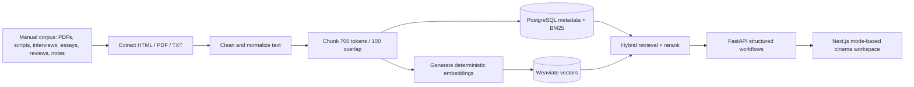

# Motif

Motif is a retrieval-augmented cinema analysis platform for psychologically rich films. It synthesizes criticism, creator interviews, screenplays, essays, academic analysis, production notes, craft writing, reviews, and transcripts into cited interpretive answers.

Motif is not a generic movie chatbot. It is a curated research system for interpretation, comparison, influence, recurring themes, and critical disagreement across a focused corpus.

## Current Corpus

- Active films: 18
- Active source manifest: `data/manual_sources.csv`
- Ingested locally: 142 documents
- Ingested chunks/vectors: 1,574
- Storage: PostgreSQL metadata plus Weaviate vectors

The active film list is in `data/seed_films.csv`. `Perfect Blue` and `A Beautiful Mind` were removed from the active corpus.

## Repository Layout

```text
backend/    FastAPI API, Pydantic models, retrieval, synthesis, workflow endpoints
frontend/   Next.js analysis UI with mode toggles, search, filters, answers, and source trail
ingestion/  Manual corpus extraction, cleaning, chunking, embeddings, and DB/vector loading
evals/      Corpus verification and retrieval-quality checks
infra/      Docker and PostgreSQL schema
notebooks/  Manual retrieval experiments
data/       Film metadata, manual source spreadsheet/PDFs, extracted text, source manifests
docs/       Deployment runbook
```

## Week 1: Corpus + Ingestion Foundation

Implemented:

- Repository structure for `frontend`, `backend`, `ingestion`, `evals`, `infra`, `notebooks`, and `data`
- Docker Compose with PostgreSQL and Weaviate
- PostgreSQL schema for films, sources, documents, chunks, relations, and indexes
- Source metadata manifest
- HTML ingestion
- PDF ingestion
- Manual text ingestion
- Text extraction and cleaning
- Navigation/header/footer/ad artifact cleanup
- 700-token chunking with 100-token overlap
- Stable chunk IDs
- Deterministic local embeddings
- PostgreSQL metadata storage
- Weaviate vector storage
- Manual retrieval notebook
- README and architecture diagram

## Week 2: Basic RAG App

Implemented:

- Corpus expanded beyond Week 2 target: 18 films, 142 usable documents
- FastAPI backend
- `POST /retrieve`
- `POST /answer`
- Top-k vector retrieval
- Film interpretation prompt templates
- Citation grounding
- Coverage scoring: `high`, `medium`, `low`
- Refusal behavior when evidence is insufficient
- Next.js frontend
- Homepage search
- Answer panel
- Citation/source cards as “Follow the Trail”
- Film and source filters
- Loading and error states
- Vercel frontend configuration
- Render backend configuration

## Week 3: Better Retrieval + Cinema Workflows

Implemented:

- Corpus exceeds Week 3 target: 142 documents across 18 films
- PostgreSQL full-text BM25-style retrieval
- Weaviate/local vector retrieval
- Hybrid retrieval: vector top 25 plus BM25 top 25
- Merge and deduplicate retrieved chunks
- Local reranking over merged results
- Return best 8-12 chunks to synthesis
- Metadata filters for film, director, year, source type, critic/author, and theme
- Source balancing
- Required-film balancing for multi-film comparison retrieval
- Interpretation Map workflow
- Film Comparison workflow
- Theme Explorer workflow
- Structured outputs with Pydantic
- Retrieval quality test before/after reranking
- Frontend mode toggle for:
  - The Read
  - Interpretation Map
  - Film Comparison
  - Theme Explorer

## Quick Start

Start infrastructure:

```bash
docker compose up -d postgres weaviate
```

Install backend/ingestion dependencies:

```bash
python -m venv .venv
source .venv/bin/activate
pip install -r ingestion/requirements.txt
pip install -r backend/requirements.txt
```

Build the manual source manifest from the uploaded spreadsheet/PDFs:

```bash
.venv/bin/python -m ingestion.build_manual_corpus
```

Ingest the active corpus:

```bash
.venv/bin/python -m ingestion.cli ingest --sources data/manual_sources.csv --reset
```

Run the backend:

```bash
cd backend
PYTHONPATH=. ../.venv/bin/uvicorn app.main:app --reload
```

Run the frontend:

```bash
cd frontend
pnpm install
pnpm run dev
```

## API

Retrieve evidence:

```bash
curl -X POST http://localhost:8000/retrieve \
  -H "Content-Type: application/json" \
  -d '{"query":"doubling and fractured identity","top_k":12}'
```

Answer:

```bash
curl -X POST http://localhost:8000/answer \
  -H "Content-Type: application/json" \
  -d '{"query":"How does memory shape identity in Memento?","film_slugs":["memento"],"top_k":12}'
```

Interpretation Map:

```bash
curl -X POST http://localhost:8000/workflows/interpretation-map \
  -H "Content-Type: application/json" \
  -d '{"query":"What competing readings does Black Swan invite?","film_slugs":["black-swan"],"top_k":12}'
```

Film Comparison:

```bash
curl -X POST http://localhost:8000/workflows/film-comparison \
  -H "Content-Type: application/json" \
  -d '{"query":"Compare obsession and performance.","film_slugs":["the-prestige","black-swan"],"comparison_films":["the-prestige","black-swan"],"top_k":12}'
```

Theme Explorer:

```bash
curl -X POST http://localhost:8000/workflows/theme-explorer \
  -H "Content-Type: application/json" \
  -d '{"query":"How does surveillance shape identity?","theme":"surveillance","top_k":12}'
```

## Verification

```bash
.venv/bin/python -m compileall backend/app ingestion evals
.venv/bin/python -m evals.verify_corpus --sources data/manual_sources.csv --min-per-film 7
.venv/bin/python evals/test_retrieval_quality.py
```

Frontend build:

```bash
cd frontend
pnpm run build
```

## Architecture



## Answer Contract

Motif answers return:

- Consensus interpretation
- Alternative interpretations
- Director/creator perspective
- Critical reception
- Related films in the corpus
- Cited trail sources
- Coverage score and coverage level

When the corpus does not support an answer, Motif refuses and explains the coverage limitation.
