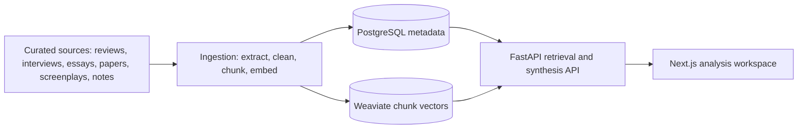

# Motif

Motif is a retrieval-augmented cinema analysis platform for psychologically rich films. It is built to synthesize film criticism, director interviews, screenplays, essays, academic analysis, production notes, and video essay transcripts into cited interpretive answers.

The MVP is not a generic movie chatbot. It is a curated research system for questions about interpretation, comparison, influence, recurring themes, and critical disagreement across a focused film corpus.

## Week 1 Scope

- Local Docker services for PostgreSQL and Weaviate
- Metadata schema for films, sources, documents, and chunks
- Seed source metadata for the first 5 films
- HTML, PDF, and manual text ingestion
- Text cleaning and token-aware chunking
- Stable chunk IDs
- Embedding generation interface with deterministic local fallback
- Metadata persistence in PostgreSQL
- Chunk persistence in Weaviate
- Manual retrieval notebook
- FastAPI backend skeleton
- Next.js frontend skeleton

## First 5 Films

- Mulholland Drive
- Persona
- Black Swan
- Perfect Blue
- Taxi Driver

## Repository Layout

```text
backend/    FastAPI API and retrieval orchestration
frontend/   Next.js interface for cinematic analysis queries
ingestion/  Corpus extraction, cleaning, chunking, embeddings, and loading
evals/      Evaluation prompts and expected answer criteria
infra/      Docker and database schema
notebooks/  Manual retrieval experiments
data/       Seed metadata, raw inputs, and processed artifacts
```

## Quick Start

1. Copy environment variables:

```bash
cp .env.example .env
```

2. Start infrastructure:

```bash
docker compose up -d postgres weaviate
```

3. Install backend dependencies:

```bash
cd backend
python -m venv .venv
source .venv/bin/activate
pip install -r requirements.txt
```

4. Load the schema:

```bash
psql "$DATABASE_URL" -f ../infra/postgres/001_schema.sql
```

5. Ingest seed metadata and any available local documents:

```bash
python -m ingestion.cli ingest --sources ../data/seed_sources.csv
```

6. Run the backend:

```bash
uvicorn app.main:app --reload
```

7. Run the frontend:

```bash
cd ../frontend
npm install
npm run dev
```

## Architecture



## Answer Contract

Motif answers should return:

- Consensus interpretation
- Alternative interpretations
- Director/creator perspective
- Critical reception
- Related films in the corpus
- Cited sources
- Coverage score

If the corpus does not support an answer, Motif should say so and explain which source coverage is missing.

