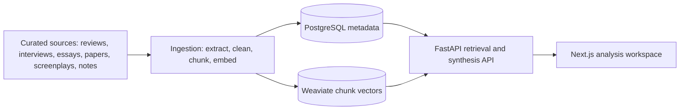

# Motif

Motif is a retrieval-augmented cinema analysis platform for psychologically rich films. It is built to synthesize film criticism, director interviews, screenplays, essays, academic analysis, production notes, and video essay transcripts into cited interpretive answers.

The MVP is not a generic movie chatbot. It is a curated research system for questions about interpretation, comparison, influence, recurring themes, and critical disagreement across a focused film corpus.

## Week 1 Scope

- Local Docker services for PostgreSQL and Weaviate
- Metadata schema for films, sources, documents, and chunks
- Seed source metadata for the first 5 films
- HTML, PDF, and manual text ingestion
- Text cleaning and token-aware chunking
- Stable chunk IDs
- Embedding generation interface with deterministic local fallback
- Metadata persistence in PostgreSQL
- Chunk persistence in Weaviate
- Manual retrieval notebook
- FastAPI backend skeleton
- Next.js frontend skeleton

## Week 2 Scope

- Public corpus expanded to 10 films
- 150 public local documents, 15 per film
- `POST /retrieve` for top-k vector retrieval
- `POST /answer` for grounded answer synthesis
- Film and source-type filters
- Prompt templates for interpretation synthesis
- Citation grounding to retrieved chunks
- High, medium, and low coverage scoring
- Refusal behavior when evidence is insufficient
- Next.js search UI with answer panel, citation cards, filters, loading state, and error state
- Vercel and Render deployment configuration

## First 5 Films

- Mulholland Drive
- Persona
- Black Swan
- Perfect Blue
- Taxi Driver

## Week 2 Films

- Fight Club
- The Lighthouse
- Shutter Island
- Eternal Sunshine of the Spotless Mind
- Synecdoche, New York

## Repository Layout

```text
backend/    FastAPI API and retrieval orchestration
frontend/   Next.js interface for cinematic analysis queries
ingestion/  Corpus extraction, cleaning, chunking, embeddings, and loading
evals/      Evaluation prompts and expected answer criteria
infra/      Docker and database schema
notebooks/  Manual retrieval experiments
data/       Seed metadata, raw inputs, and processed artifacts
```

## Quick Start

1. Copy environment variables:

```bash
cp .env.example .env
```

2. Start infrastructure:

```bash
docker compose up -d postgres weaviate
```

3. Install backend dependencies:

```bash
cd backend
python -m venv .venv
source .venv/bin/activate
pip install -r requirements.txt
```

4. Load the schema:

```bash
psql "$DATABASE_URL" -f ../infra/postgres/001_schema.sql
```

5. Build and ingest the public corpus:

```bash
python -m ingestion.build_public_corpus
python -m ingestion.cli ingest --sources data/public_sources.csv
```

6. Run the backend:

```bash
uvicorn app.main:app --reload
```

7. Run the frontend:

```bash
cd ../frontend
npm install
npm run dev
```

## API

Retrieve evidence:

```bash
curl -X POST http://localhost:8000/retrieve \
  -H "Content-Type: application/json" \
  -d '{"query":"doubling and fractured identity","top_k":12}'
```

Answer with grounding and refusal behavior:

```bash
curl -X POST http://localhost:8000/answer \
  -H "Content-Type: application/json" \
  -d '{"query":"How do Persona and Perfect Blue use performance to fracture identity?","film_slugs":["persona","perfect-blue"],"source_types":["essay","academic","interview"],"top_k":12}'
```

## Verification

```bash
python -B -m compileall backend ingestion evals
python evals/verify_corpus.py
```

The Week 2 public corpus lives in `data/public_sources.csv` and `data/raw/public/*.txt`. It currently contains 150 local documents, 15 per film, and is intentionally rebuildable from public web sources via `python -m ingestion.build_public_corpus`.

The current public corpus uses public pages and public review pages. Script text is represented by public plot/source summaries as a temporary screenplay proxy; replace those rows with licensed screenplay files when available.

## Deployment

See [docs/deployment.md](docs/deployment.md) for the current deployment runbook.

Frontend:

- Import `frontend/` into Vercel.
- Set `NEXT_PUBLIC_API_URL` to the deployed backend URL.
- The Vercel config lives at `frontend/vercel.json`.
- Local build verified with the bundled Codex Node runtime:

```bash
cd frontend
PATH=/Users/tanishaprasad/.cache/codex-runtimes/codex-primary-runtime/dependencies/node/bin:/Users/tanishaprasad/.cache/codex-runtimes/codex-primary-runtime/dependencies/bin:$PATH pnpm run build
```

Backend:

- Import the repo into Render using `render.yaml`.
- Set `DATABASE_URL`, `WEAVIATE_URL`, and `FRONTEND_ORIGIN`.
- The backend Dockerfile lives at `backend/Dockerfile`.

## Architecture



## Answer Contract

Motif answers should return:

- Consensus interpretation
- Alternative interpretations
- Director/creator perspective
- Critical reception
- Related films in the corpus
- Cited sources
- Coverage score

If the corpus does not support an answer, Motif should say so and explain which source coverage is missing.
